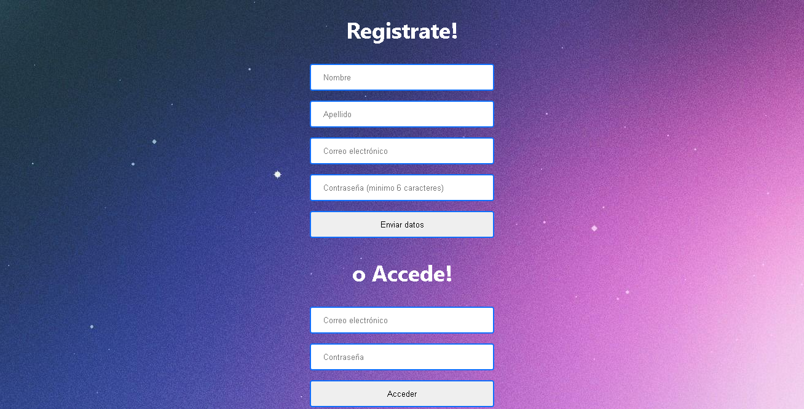
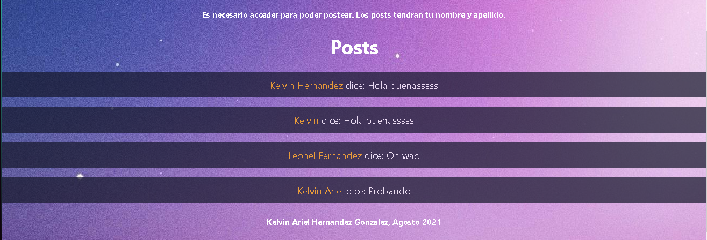
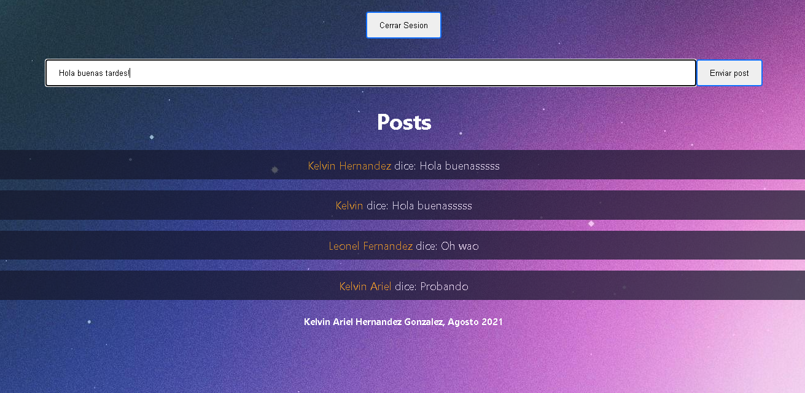

# Proyecto Final - Sistema web de posts

Este proyecto esta conectado a Firebase. Utiliza la autenticacion de la misma para crear o extraer al usuario en cuestion, guardando o buscando en firestore con el mismo UID para ambos registros.

Los posts son independientes del usuario tras ser creados, pero se crean a nombre de un usuario obligatoriamente.

## Te permite registrarte o iniciar sesion. No te preocupes, solo Google puede saber tu contraseña.

## Puedes ver lo que ha posteado otra gente, registrado o no.

## Solo aquellos registrados pueden postear.

